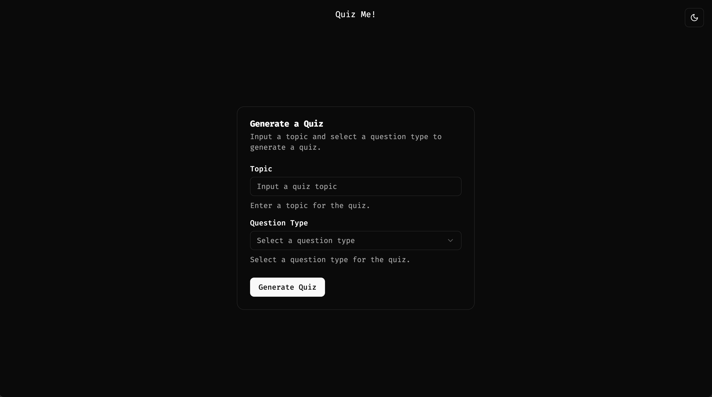

# LLM-Trivia-Game

## Overview


This app quizzes users on a predefined topic in the style of a trivia game. It takes a user defined topic and creates quiz questions to be used as a learning mechanism. The app uses ChatGPT's API to generate quiz questions and answers.


## Built With
* 
* 
* 
* 
* 


## Installation and Setup
1. **Install Dependencies**
    ```bash
    cd backend
    pip install -r requirements.txt
    ```

2. **Setup Database**
    ```bash
    alembic init alembic
    ```

    Edit alembic.ini
    ```bash
    sqlalchemy.url = sqlite:///./quizgen.db
    ```

    Edit alembic/env.py. NOTE: MAKE SURE YOU IMPORT ALL MODELS HERE
    ```bash
    import sys
    import os
    sys.path.append(os.path.abspath(os.path.join(os.path.dirname(__file__), '..')))

    from backend.core.database import Base
    from backed.models import user  # import all models here
    target_metadata = Base.metadata
    ```

    Create/Apply Migration
    ```bash
    alembic revision --autogenerate -m "initial"
    alembic upgrade head
    ```


3. **Run the Flask app**:
    ```bash
    flask --app main run
    ```

4. **Set OpenAI API Key**
    Create a .env file in the project root and add

    ```bash
    OPENAI_API_KEY='YOUR_KEY'
    ```

5. **Launch Frontend from trivia-frontend**
    ```bash
    cd trivia-frontend
    npm run dev
    ```

## Roadmap
- [] Favorite questions/add to set.
- [] Add question corrections for incorrect answer, poorly worded question.
- [] Add user management.
- [] Add payment and tier system to pay for OpenAPI usage
- [] Deploy
- [] Add PDF extraction to create quizzes based on text

## ShadCN
Used in the frontend for prebuilt components.

Add components using:
```bash
npx shadcn@canary add button
```
Install with:
https://ui.shadcn.com/docs/tailwind-v4
