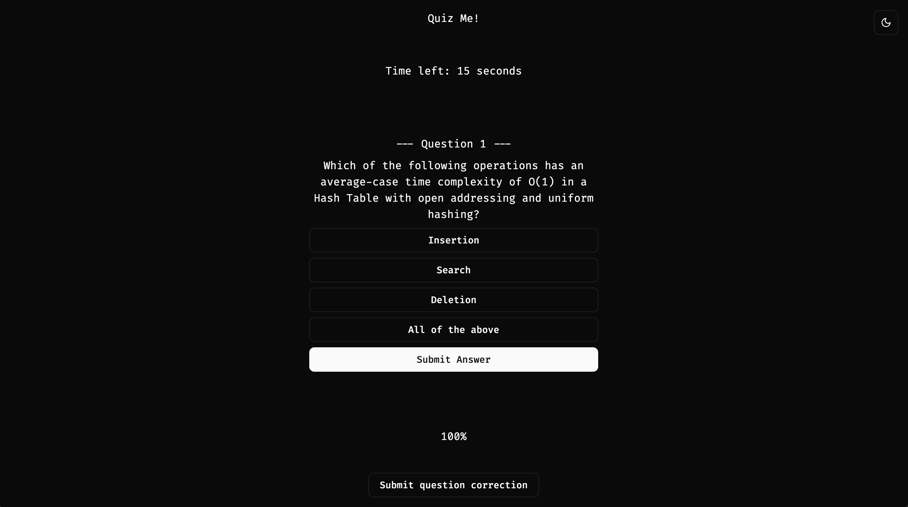

# LLM-Trivia-Game

## Overview


This app quizzes users on a predefined topic in the style of a trivia game. It takes a user defined topic and creates quiz questions to be used as a learning mechanism. The app uses ChatGPT's API to generate quiz questions and answers.



## Built With
* 
* 
* 
* 
* 


## Installation and Setup
1. **Install Dependencies**
    ```bash
    pip install -r requirements.txt

2. **Run the Flask app**:
    ```bash
    flask --app main run
    ```

3. **Set OpenAI API Key**
    Windows:
    ```bash
    $env:OPENAI_API_KEY="your_openai_api_key"
    ```
    Mac:
    ```bash
    export OPENAI_API_KEY=your_key
    ```

4. **Launch Frontend from trivia-frontend**
    ```bash
    cd trivia-frontend
    npm run dev
    ```

## Roadmap
- [] Add user management
- [] Add payment system to pay for OpenAPI usage
- [] Deploy
- [] Add PDF extraction to create quizzes based on some text

## ShadCN
Used in the frontend for prebuilt components.

Add components using:
```bash
npx shadcn@canary add button
```
Install with:
https://ui.shadcn.com/docs/tailwind-v4
